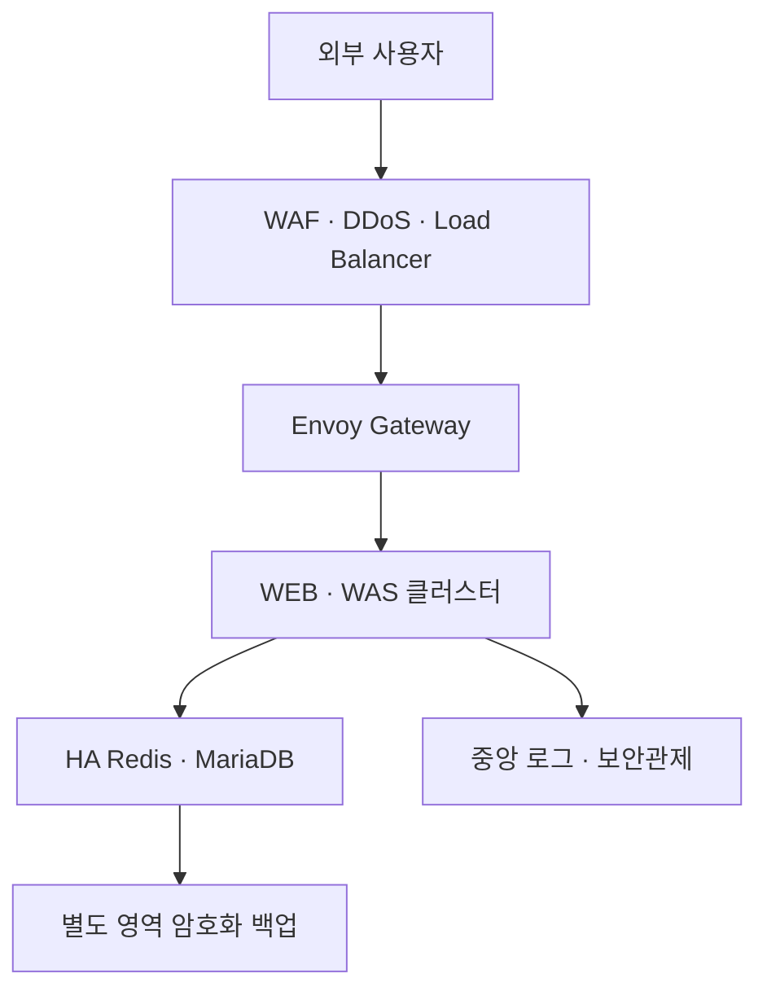

# Rocky Linux 9.8 단일 노드 Kubernetes 보안 점검·조치 가이드

작성 기준일: 2026-09-17  
대상 환경: Rocky Linux 9.8, kubeadm, containerd, Calico, 단일 노드, Envoy Gateway, NGINX WEB, Spring Boot WAS, Redis, MariaDB  
목적: ISMS-P, ISO/IEC 27001:2022 및 금융권 보안 요구사항에 대응하기 위한 기술·운영 점검 기준과 조치 예시

> 이 문서는 인증 취득 또는 감독기관 적합 판정을 보장하는 문서가 아니다. 인증 범위, 처리 정보, 중요도, 계약, 최신 법령과 회사 정책에 따라 적용 항목이 달라진다. 실제 심사에는 설정값뿐 아니라 승인 기록, 담당자, 주기, 점검 결과, 예외 승인, 장애·복구 시험 결과가 함께 필요하다.

## 1. 먼저 판단할 사항

### 1.1 단일 노드의 구조적 한계

현재 한 서버에 Kubernetes 제어부, WEB, WAS, Redis, MariaDB와 로컬 PV가 함께 있다. 서버·디스크·전원·네트워크·OS 장애 하나가 전체 서비스와 데이터베이스에 동시에 영향을 준다. 논리적 NetworkPolicy는 적용할 수 있지만 물리적 장애 영역, 운영자 권한, 제어부와 업무 시스템을 분리할 수 없다.

따라서 다음과 같이 판단한다.

| 용도 | 판단 |
|---|---|
| 개인 학습·개발·기능 검증 | 보완 통제와 위험 수용 기록을 두고 사용 가능 |
| 개인정보가 없는 사내 비중요 테스트 | 접근 제한, 가명·합성 데이터, 백업을 조건으로 사용 가능 |
| 실 개인정보 처리 | 개인정보 영향과 인증 범위를 검토하고 다중 노드·외부 백업·중앙 로그로 개선 권고 |
| 금융거래·중요 전자금융업무 운영 | 단일 노드를 운영 목표 구조로 사용하지 않는 것이 타당함 |

금융 중요업무의 목표 구조는 최소한 다중 가용영역의 Kubernetes 노드, 관리형 또는 이중화 DB, Redis 고가용성, WAF/LB, 별도 계정·영역의 불변 백업, 중앙 보안관제와 재해복구 환경을 포함해야 한다.



### 1.2 세 기준을 적용하는 방법

ISMS-P와 ISO/IEC 27001은 관리체계와 위험관리를 요구한다. 금융보안 요구사항은 여기에 전자금융업무 중요도 평가, 클라우드 제공자 관리, 전자금융기반시설 취약점 분석·평가, 업무연속성, 감독·보고와 위탁 통제를 더 강하게 요구할 수 있다.

| 실무 영역 | ISMS-P 관점 | ISO/IEC 27001:2022 관점 | 금융권 추가 관점 |
|---|---|---|---|
| 범위·자산 | 인증 범위, 자산 식별, 위험관리 | 조직 상황, 위험평가·처리, 자산 목록 | 전자금융업무 중요도, 기반시설·클라우드 범위 |
| 계정·권한 | 사용자 인증, 최소권한, 접근통제 | Annex A 조직·기술 통제 | 직무분리, 중요 작업 승인·추적, 특권계정 통제 |
| 암호화 | 전송·저장 암호화, 키 관리 | 암호 사용 및 키 관리 | 중요정보 암호화, 키 분리·수명주기, 검증된 암호모듈 요구 검토 |
| 운영·로그 | 변경, 장애, 백업, 로그, 침해대응 | 로깅·모니터링·변경·연속성 | 상시감시, 전자금융 사고 대응·보고, 복구 목표·훈련 |
| 개발·공급망 | 안전한 개발, 취약점 조치, 외부자 관리 | 개발 수명주기·공급망·클라우드 통제 | CSP/MSP 평가, 계약·감사권·재위탁·종료 전략 |
| 개인정보 | 수집 최소화, 보유·파기, 정보주체 권리 | 개인정보 관련 법규·위험 통제 | 신용정보·거래정보 등 적용 법령과 업권 규정 추가 검토 |

기준 원문은 [ISMS-P 인증기준 안내서와 세부점검항목](https://isms-p.or.kr/ntcn/rcsrm/selectGnrlRcsrmList.do), [금융권에 적합한 ISMS-P 점검항목](https://www.fsec.or.kr/bbs/detail?bbsNo=11386&menuNo=247), [ISO/IEC 27001:2022 개요](https://www.iso.org/standard/27001), 금융보안원의 최신 [금융분야 클라우드컴퓨팅서비스 이용 가이드](https://www.fsec.or.kr/)를 기준으로 최종 확인한다. 금융보안원은 2025년 개정 가이드를 공지했으며, 전자금융기반시설 상세 평가항목은 연도별 최신본을 평가 담당 부서에서 확보해야 한다.

## 2. 현재 구성에 대한 1차 판정

제공된 `k8s-three-tier` 매니페스트를 정적 검토한 결과다. 실제 서버 설정은 아래 점검 명령으로 확인해야 한다.

| 항목 | 현재 상태 | 판정 | 우선 조치 |
|---|---|---|---|
| 앱 네임스페이스 기본 차단 | Calico default-deny와 허용 정책 존재 | 양호 | 정책 통신시험과 변경 증적 유지 |
| DB·Redis 외부 노출 | ClusterIP | 양호 | 방화벽에서도 3306/6379 외부 차단 확인 |
| ServiceAccount 토큰 | 앱 Pod에서 자동 마운트 비활성 | 양호 | 신규 워크로드에도 기본 적용 |
| WAS 컨테이너 | 비루트, 권한상승 금지, capability 제거, seccomp | 양호 | 읽기 전용 루트 파일시스템 검토 |
| WEB 컨테이너 | root 가능 이미지, 상세 보안 컨텍스트 없음 | 미흡 | unprivileged NGINX, 8080, 권한 제거 적용 |
| MariaDB·Redis 컨테이너 | seccomp만 설정 | 미흡 | UID/GID 검증 후 비루트·권한상승 금지·capability 제거 |
| 이미지 무결성 | `stable-alpine`, `11.8`, `8` 등 변경 가능한 태그 | 미흡 | 승인 레지스트리와 digest 고정, 스캔·서명·SBOM |
| TLS | 실습용 자체서명 인증서 | 운영 부적합 | 공인 또는 조직 CA, 자동 갱신, 만료 감시 |
| 외부 진입 | Envoy의 동적 NodePort | 개선 필요 | 고정 LB/WAF 앞단, 원본 IP 접근 제한 |
| Kubernetes Secret | etcd 저장 암호화 확인 안 됨 | 미흡 | 외부 비밀관리 및 etcd 암호화 |
| 감사로그 | API 감사로그 구성 확인 안 됨 | 미흡 | kube-apiserver audit 활성화, 원격 전송 |
| 저장소 | 서버 로컬 PV | 고위험 | 볼륨 암호화, 외부 암호화 백업, 복구시험 |
| 가용성 | 단일 노드·단일 DB | 고위험 | 운영 전 다중 노드·DB HA·DR 설계 |
| Pod Security Admission | 네임스페이스 라벨 없음 | 미흡 | warn/audit 후 Restricted enforce |
| 중앙 모니터링 | 구성 확인 안 됨 | 미흡 | OS·K8s·앱·DB 로그와 경보 중앙화 |

## 3. 변경 전에 수집할 읽기 전용 기준선

출력에는 IP, 계정명, 인증서 정보가 포함될 수 있으므로 접근 통제된 증적 저장소에 보관한다.

```bash
sudo install -d -m 0700 /root/security-evidence
EVIDENCE="/root/security-evidence/$(date +%F_%H%M%S)"
sudo install -d -m 0700 "$EVIDENCE"

{
  date -Is
  cat /etc/rocky-release
  uname -a
  getenforce
  sestatus
  timedatectl
  systemctl is-active firewalld auditd chronyd containerd kubelet
  ss -lntup
  firewall-cmd --get-active-zones
  firewall-cmd --list-all-zones
  findmnt
  swapon --show
  sysctl net.ipv4.ip_forward kernel.kptr_restrict kernel.dmesg_restrict
} | sudo tee "$EVIDENCE/host-baseline.txt" >/dev/null

{
  kubectl version
  kubectl get nodes -o wide
  kubectl get pods,svc,ingress -A -o wide
  kubectl get gateway,httproute -A 2>/dev/null || true
  kubectl get networkpolicy -A
  kubectl get clusterrolebinding -o wide
  kubectl get namespace --show-labels
  kubectl get pv,pvc -A
} | sudo tee "$EVIDENCE/k8s-baseline.txt" >/dev/null

sudo cp -a /etc/kubernetes/manifests "$EVIDENCE/"
sudo cp -a /var/lib/kubelet/config.yaml "$EVIDENCE/kubelet-config.yaml"
sudo chmod -R go-rwx "$EVIDENCE"
```

민감한 Secret 원문, kubeconfig의 client key, 개인키 파일은 일반 점검 보고서에 첨부하지 않는다. 존재 여부, 권한, 해시, 만료일만 증적으로 남긴다.

## 4. 호스트 OS 보안

### 4.1 SELinux를 Enforcing으로 운영

컴플라이언스 운영 서버에서 `Permissive` 또는 `Disabled`를 정상 상태로 두지 않는다. Kubernetes와 containerd는 SELinux Enforcing에서 운영할 수 있다. 먼저 거부 로그와 애플리케이션 호환성을 시험한다.

```bash
getenforce
rpm -q container-selinux policycoreutils policycoreutils-python-utils
sudo ausearch -m AVC,USER_AVC -ts recent
```

현재가 `Permissive`이면 시험 환경에서 다음을 적용한다.

```bash
sudo dnf install -y container-selinux policycoreutils-python-utils
sudo setenforce 1
sudo sed -ri 's/^SELINUX=.*/SELINUX=enforcing/' /etc/selinux/config
getenforce
```

현재가 `Disabled`이면 즉시 `setenforce`할 수 없다. 콘솔 접근과 백업을 확보하고 다음 부팅 때 전체 레이블을 재설정한다.

```bash
sudo sed -ri 's/^SELINUX=.*/SELINUX=enforcing/' /etc/selinux/config
sudo fixfiles -F onboot
sudo reboot
```

재부팅 후 `getenforce`, 모든 Pod 상태, Calico 통신, 로컬 PV 접근, `ausearch -m AVC -ts boot`를 확인한다. AVC를 무조건 허용하는 광범위한 로컬 정책은 만들지 말고 원인을 수정한다.

### 4.2 SSH와 관리자 진입점

관리 접속은 VPN 또는 배스천을 통해서만 허용하고 개인별 키와 MFA를 사용한다. 공용 인터넷에서 22/tcp를 전체 허용하지 않는다.

```bash
sudo sshd -T | egrep 'permitrootlogin|passwordauthentication|pubkeyauthentication|maxauthtries|allowgroups|clientalive'
```

키 로그인이 검증된 후 `/etc/ssh/sshd_config.d/60-security.conf`에 조직 정책을 반영한다.

```text
PermitRootLogin no
PasswordAuthentication no
KbdInteractiveAuthentication no
PubkeyAuthentication yes
MaxAuthTries 3
ClientAliveInterval 300
ClientAliveCountMax 2
AllowGroups ssh-admins
```

```bash
sudo sshd -t
sudo systemctl reload sshd
```

기존 세션을 닫기 전에 별도 창에서 새 관리 계정 로그인을 시험한다. 공유 계정과 공유 개인키를 금지하고 퇴직·이동 시 즉시 회수한다.

### 4.3 방화벽과 NCP ACG

클라우드 ACG와 호스트 firewalld를 모두 적용한다. 허용 소스는 실제 관리망·VPN·LB 대역으로 제한한다.

| 포트 | 허용 대상 | 외부 공개 여부 |
|---|---|---|
| 22/tcp | VPN/배스천 관리 IP | 금지 |
| 6443/tcp | Kubernetes 관리자·승인 자동화 대역 | 금지 |
| 443 또는 고정 NodePort | WAF/LB 원본 대역 | 직접 공개 지양 |
| 10250/tcp | 노드·관리 구성요소 대역 | 금지 |
| 2379-2380/tcp | 로컬/제어부만 | 금지 |
| 10257, 10259/tcp | 로컬 제어부만 | 금지 |
| 3306, 6379, 8080 | 클러스터 내부만 | 금지 |

현재 노출을 확인한다.

```bash
sudo ss -lntup
sudo firewall-cmd --list-all-zones
kubectl get svc -A -o custom-columns='NS:.metadata.namespace,NAME:.metadata.name,TYPE:.spec.type,PORTS:.spec.ports[*].nodePort'
```

NodePort는 재생성해도 변하지 않도록 승인된 번호로 고정하고, ACG에는 WAF/LB 또는 VPN 출발지만 허용한다. 외부 사용자 트래픽은 WAF/LB에서 TLS 정책, 속도 제한, 공격 차단을 적용한 뒤 Envoy로 전달한다.

### 4.4 패치, 시간, 감사, 파일 무결성

```bash
sudo dnf updateinfo list security
sudo systemctl enable --now chronyd
chronyc tracking
sudo dnf install -y audit aide
sudo systemctl enable --now auditd
sudo aide --init
```

보안패치는 자산 중요도와 CVSS, 실제 노출도를 기준으로 SLA를 정한다. 운영 반영 전 테스트, 변경 승인, 롤백 계획, 결과를 남긴다. `dnf-automatic` 무조건 재부팅보다 승인된 정기 패치 창이 적합하다.

감사 대상으로 최소한 다음을 포함한다.

- `/etc/kubernetes`, `/var/lib/kubelet`, `/etc/containerd`, `/etc/ssh`, `/etc/sudoers*` 변경
- 사용자·그룹·sudo 변경과 인증 실패
- 시간 변경, 모듈 적재, 방화벽 변경
- 관리 명령과 중요 파일 접근

audit 규칙은 환경 검증 후 적용하고 마지막에 immutable 모드를 켠다. immutable 모드는 재부팅 전 변경이 어려우므로 정책 시험 전에 켜지 않는다. audit 로그도 원격 수집기로 전송한다.

### 4.5 커널과 서비스

Kubernetes에는 IP forwarding이 필요하므로 일반 서버 기준을 그대로 적용해 `net.ipv4.ip_forward=0`으로 만들면 안 된다. Calico의 encapsulation, BGP, reverse-path 요구도 함께 검증한다.

```bash
sysctl net.ipv4.ip_forward
sysctl kernel.kptr_restrict kernel.dmesg_restrict kernel.yama.ptrace_scope
systemctl list-unit-files --state=enabled
rpm -qa --qf '%{NAME} %{VERSION}-%{RELEASE}\n' | sort
```

사용하지 않는 cockpit, 웹 관리도구, 파일공유, 컴파일러·디버거와 서버 패키지를 제거하거나 중지한다. `kernel.kptr_restrict=2`, `kernel.dmesg_restrict=1`, `kernel.yama.ptrace_scope=1` 등은 호환성 시험 후 적용한다. swap은 kubelet 설정과 일치시켜 비활성 상태를 유지한다.

디스크 암호화는 신규 서버 구축 단계에서 LUKS 또는 클라우드 볼륨 KMS 암호화를 선택한다. 운영 중인 루트·데이터 디스크의 사후 암호화는 백업·재구축 방식이 더 안전하다. 금융권에서 FIPS 요구가 확정된 경우 이미지·암호 라이브러리·애플리케이션 호환성을 검증하고 신규 빌드 단계에서 FIPS 모드를 적용한다.

## 5. Kubernetes 제어부 보안

Kubernetes 공식 [Security Checklist](https://kubernetes.io/docs/concepts/security/security-checklist/)와 환경 버전에 맞는 CIS Kubernetes Benchmark를 기준선으로 사용한다.

### 5.1 중요 파일 소유권과 권한

```bash
sudo stat -c '%a %U:%G %n' \
  /etc/kubernetes/admin.conf \
  /etc/kubernetes/kubelet.conf \
  /var/lib/kubelet/config.yaml \
  /etc/kubernetes/manifests/*.yaml \
  /etc/kubernetes/pki/ca.key \
  /etc/kubernetes/pki/sa.key
```

개인키와 관리자 kubeconfig는 root만 읽도록 `0600`, 디렉터리는 최소 `0700`으로 제한한다. `admin.conf`를 개인 PC와 여러 운영자가 공유하지 않는다. 사용자별 인증과 최소 RBAC를 발급하고 인증서 만료·회수 절차를 둔다.

```bash
sudo chmod 600 /etc/kubernetes/admin.conf /etc/kubernetes/pki/ca.key /etc/kubernetes/pki/sa.key
sudo chown root:root /etc/kubernetes/admin.conf /etc/kubernetes/pki/ca.key /etc/kubernetes/pki/sa.key
sudo kubeadm certs check-expiration
```

### 5.2 API 서버·etcd·kubelet 확인

```bash
sudo grep -E -- '--anonymous-auth|--authorization-mode|--enable-admission-plugins|--audit|--encryption-provider-config|--profiling|--bind-address' /etc/kubernetes/manifests/kube-apiserver.yaml
sudo grep -E -- '--client-cert-auth|--peer-client-cert-auth|--listen-client-urls|--listen-peer-urls' /etc/kubernetes/manifests/etcd.yaml
sudo grep -E 'anonymous:|authorization:|readOnlyPort:|rotateCertificates:|protectKernelDefaults:' /var/lib/kubelet/config.yaml
```

목표값은 다음과 같다.

- API 익명 인증은 불필요하면 비활성화한다.
- authorization mode는 `Node,RBAC`, admission에는 `NodeRestriction`을 포함한다.
- kubelet 익명 인증은 `false`, authorization은 `Webhook`, read-only port는 `0`으로 한다.
- scheduler와 controller-manager의 비보안 원격 바인딩을 두지 않는다.
- etcd는 client/peer 인증서를 검증하고 2379/2380을 외부에 노출하지 않는다.
- kubelet 인증서 자동 순환과 서버 인증서 수명주기를 운영한다.
- profiling/debug endpoint는 업무상 필요가 없으면 비활성화한다.

정적 Pod 매니페스트를 바꾸면 해당 제어 구성요소가 즉시 재시작된다. 변경 전 etcd snapshot과 파일 백업을 만들고 콘솔 접근을 확보한다. 한 번에 한 구성요소만 변경하고 `kubectl get --raw='/readyz?verbose'`로 확인한다.

### 5.3 Kubernetes API 감사로그

Kubernetes 감사는 사용자·애플리케이션·제어부가 API에서 수행한 행위를 시간 순서로 기록한다. 공식 [Auditing 문서](https://kubernetes.io/docs/tasks/debug/debug-cluster/audit/)에 따라 정책과 backend를 구성한다.

예시 `/etc/kubernetes/audit-policy.yaml`:

```yaml
apiVersion: audit.k8s.io/v1
kind: Policy
omitStages:
  - RequestReceived
rules:
  - level: None
    nonResourceURLs: ["/healthz*", "/livez*", "/readyz*", "/metrics"]
  - level: Metadata
    resources:
      - group: ""
        resources: ["secrets", "configmaps"]
  - level: RequestResponse
    verbs: ["create", "update", "patch", "delete", "deletecollection"]
  - level: Metadata
```

Secret은 요청·응답 본문을 남기지 않고 Metadata만 기록한다. kube-apiserver에 다음 플래그와 hostPath/volumeMount를 추가한다.

```text
--audit-policy-file=/etc/kubernetes/audit-policy.yaml
--audit-log-path=/var/log/kubernetes/audit/audit.log
--audit-log-maxage=30
--audit-log-maxbackup=10
--audit-log-maxsize=100
```

감사로그는 로컬 보관으로 끝내지 않고 TLS를 사용해 중앙 로그 시스템으로 전송한다. 보존기간은 개인정보·신용정보·전자금융거래 관련 법령, 사고조사 필요기간, 내부 정책을 기준으로 승인한다. NTP 동기화, 로그 접근권한, 삭제 방지, 검색·경보, 정기 샘플 검토를 증적으로 남긴다.

### 5.4 etcd 저장 데이터 암호화

Kubernetes Secret은 Base64 인코딩일 뿐이다. [Encrypting Confidential Data at Rest](https://kubernetes.io/docs/tasks/administer-cluster/encrypt-data/)에 따라 API 서버 수준 암호화를 적용한다. 금융 운영 환경은 외부 KMS/HSM과 키 접근 분리를 권장한다. 단일 서버의 로컬 `secretbox` 키는 디스크 탈취 위험은 낮추지만 root 탈취에는 충분하지 않다.

적용 순서는 다음과 같다.

1. etcd snapshot, `/etc/kubernetes`, 암호화 설정과 키를 별도 보안 저장소에 백업한다.
2. `EncryptionConfiguration`을 만들고 root만 읽도록 한다.
3. kube-apiserver에 `--encryption-provider-config`와 read-only mount를 추가한다.
4. API readiness와 Secret 읽기를 시험한다.
5. 기존 Secret을 API를 통해 다시 써서 암호화한다.
6. etcd 원문에서 평문이 보이지 않는지 검증한다.
7. 키 순환과 복구 절차를 시험한다.

로컬 대안 예시:

```bash
KEY_NAME="key-$(date +%Y%m%d)"
ENC_KEY="$(head -c 32 /dev/urandom | base64)"
sudo install -m 0600 -o root -g root /dev/null /etc/kubernetes/encryption-config.yaml
sudo tee /etc/kubernetes/encryption-config.yaml >/dev/null <<EOF
apiVersion: apiserver.config.k8s.io/v1
kind: EncryptionConfiguration
resources:
  - resources:
      - secrets
    providers:
      - secretbox:
          keys:
            - name: ${KEY_NAME}
              secret: ${ENC_KEY}
      - identity: {}
EOF
unset ENC_KEY
```

kube-apiserver에 설정을 마운트한 뒤 검증하고, 유지보수 시간에 기존 Secret을 재기록한다.

```bash
kubectl get --raw='/readyz?verbose'
kubectl get secrets --all-namespaces -o json | kubectl replace -f -
```

암호화 설정 파일이 유실되면 데이터를 복호화할 수 없다. 설정 파일 자체를 Git에 커밋하지 말고 키 백업·접근·교체·폐기를 별도로 통제한다.

### 5.5 RBAC와 특권계정

```bash
kubectl get clusterrolebinding -o jsonpath='{range .items[*]}{.metadata.name}{"\t"}{range .subjects[*]}{.kind}{":"}{.namespace}{":"}{.name}{" "}{end}{"\n"}{end}' | sort
kubectl auth can-i --list
kubectl get serviceaccount -A
```

조치 기준:

- `cluster-admin` 바인딩은 비상관리 계정과 승인된 자동화만 유지한다.
- 개인별 계정, SSO/OIDC, MFA, 짧은 세션과 퇴직자 회수를 적용한다.
- namespace Role/RoleBinding을 우선하며 wildcard verb/resource를 피한다.
- 서비스 계정은 워크로드별로 분리하고 토큰 자동 마운트를 기본 비활성화한다.
- 장기 bearer token, 공유 kubeconfig, CI 로그에 출력된 kubeconfig를 폐기한다.
- break-glass 계정은 봉인·경보·사후검토 절차를 둔다.
- 권한 목록과 실제 사용 여부를 정기 재검토하고 승인 증적을 보관한다.

## 6. 워크로드와 컨테이너 보안

### 6.1 Pod Security Admission

Kubernetes 공식 [Pod Security Standards](https://kubernetes.io/docs/concepts/security/pod-security-standards/)의 Restricted 프로파일을 목표로 한다. 현재 워크로드는 WEB, Redis, MariaDB 때문에 즉시 enforce하면 차단될 수 있다. 먼저 audit/warn으로 차이를 확인한다.

```bash
kubectl label --overwrite namespace three-tier \
  pod-security.kubernetes.io/audit=restricted \
  pod-security.kubernetes.io/audit-version=v1.36 \
  pod-security.kubernetes.io/warn=restricted \
  pod-security.kubernetes.io/warn-version=v1.36

kubectl apply --dry-run=server -f k8s-three-tier/manifests/
```

모든 워크로드를 수정하고 재배포 시험한 뒤 enforce를 켠다.

```bash
kubectl label --overwrite namespace three-tier \
  pod-security.kubernetes.io/enforce=restricted \
  pod-security.kubernetes.io/enforce-version=v1.36
```

시스템 네임스페이스에는 일괄 Restricted 라벨을 붙이지 않는다. Calico, Envoy와 노드 에이전트는 필요한 특권을 별도로 검토한다.

### 6.2 컨테이너 SecurityContext

업무 컨테이너의 기본 예시는 다음과 같다.

```yaml
spec:
  automountServiceAccountToken: false
  securityContext:
    seccompProfile:
      type: RuntimeDefault
  containers:
    - name: app
      securityContext:
        runAsNonRoot: true
        allowPrivilegeEscalation: false
        readOnlyRootFilesystem: true
        capabilities:
          drop: ["ALL"]
```

쓰기 경로에는 크기 제한이 있는 `emptyDir` 또는 전용 PVC를 마운트한다. UID/GID는 이미지 문서와 실제 파일 소유권을 확인한 뒤 명시한다.

현재 구성별 조치:

- WEB: `nginxinc/nginx-unprivileged` 계열을 검토하고 8080을 사용한다. `/tmp`, `/var/cache/nginx`, `/var/run`의 쓰기 경로를 따로 제공한다.
- WAS: 기존 비루트·capability 제거 설정을 유지하고 가능한 경우 `readOnlyRootFilesystem: true`를 추가한다.
- Redis: 공식 이미지의 UID와 `/data` 권한을 확인한 뒤 비루트, 권한상승 금지, capability 제거를 적용한다.
- MariaDB: 데이터 디렉터리와 초기화 과정의 UID/GID를 검증해 동일한 통제를 적용한다. 임의 UID 적용으로 DB를 손상시키지 않도록 복제 데이터에서 시험한다.
- Envoy Gateway: 공급자 기본 보안 컨텍스트, 네임스페이스 정책과 RBAC 범위를 별도로 점검한다.

`privileged`, `hostNetwork`, `hostPID`, `hostIPC`, `hostPath`, `/var/run/containerd.sock` 마운트는 기본 금지한다. 예외가 필요한 시스템 Pod는 업무 네임스페이스와 분리하고 위험·승인·보완통제를 기록한다.

### 6.3 이미지와 소프트웨어 공급망

현재 변경 가능한 태그를 digest로 고정한다.

```yaml
image: registry.example.com/approved/nginx-unprivileged@sha256:<approved-digest>
imagePullPolicy: IfNotPresent
```

배포 절차에 다음 게이트를 둔다.

1. 승인된 private registry만 허용한다.
2. OS 패키지·Java·Maven dependency를 포함해 CVE 스캔한다.
3. Critical/High 취약점의 차단 기준과 예외 만료일을 둔다.
4. SBOM을 생성하고 이미지·소스 commit·빌드 실행자를 연결한다.
5. CI에서 이미지를 서명하고 admission 단계에서 서명을 검증한다.
6. rootless·minimal base image를 사용하고 shell·package manager를 줄인다.
7. 운영 서버에서 직접 `podman build`하지 않고 통제된 CI에서 재현 가능하게 빌드한다.
8. EOL 이미지와 라이브러리를 자산 목록에서 탐지하고 교체한다.

네이티브 Pod Security Admission 외에 승인 레지스트리, digest, 필수 라벨, resource limit, 금지 volume을 강제하려면 ValidatingAdmissionPolicy 또는 검토된 Kyverno/Gatekeeper 정책을 사용한다.

### 6.4 Secret 관리

- Secret YAML과 실제 비밀번호를 Git, shell history, CI 로그에 남기지 않는다.
- 운영은 Vault 또는 클라우드 Secret Manager/KMS와 CSI/External Secrets 방식으로 가져온다.
- DB root, 앱 DB 사용자, Redis, TLS, 백업 자격증명을 서로 분리한다.
- 사람과 워크로드의 읽기 권한을 나누고 사용 로그를 남긴다.
- 생성, 배포, 순환, 폐기, 사고 시 긴급 교체 절차를 시험한다.
- Spring Boot actuator의 `env`, heap dump, 오류 응답에서 비밀이 노출되지 않게 한다.

### 6.5 NetworkPolicy와 통신 암호화

현재 `three-tier` 네임스페이스는 default deny와 DNS, Gateway→WEB/WAS, WAS→Redis/MariaDB 허용 정책이 있어 방향이 적절하다. 다음을 추가 검증한다.

```bash
kubectl get networkpolicy -n three-tier -o yaml
kubectl exec -n three-tier deploy/was -- sh -c 'nc -zvw3 mariadb-svc 3306; nc -zvw3 redis-svc 6379'
# 승인되지 않은 Pod에서 DB/Redis 연결 실패 여부도 별도 테스트 Pod로 확인
```

- Envoy Pod의 실제 label과 정책 selector가 일치하는지 확인한다.
- `envoy-gateway-system`에도 필요한 ingress/egress만 허용하는 정책을 검토한다.
- namespaceSelector만 넓게 허용하지 않고 namespace와 pod selector를 함께 사용한다.
- 외부 API, SMTP, 패키지 저장소 등 필요한 egress를 목적지·포트별로 허용한다.
- DNS exfiltration, metadata endpoint, 내부 관리망 접근을 차단한다.
- 개인정보·인증정보가 흐르는 내부 구간은 MariaDB TLS, Redis TLS 또는 검증된 mTLS 계층을 적용한다.

## 7. WEB, WAS, Redis, MariaDB 보안

### 7.1 외부 공개와 TLS

실습용 자체서명 인증서를 운영에 사용하지 않는다. 조직 CA 또는 공인 인증서를 사용하고 자동 갱신, 만료 경보, 개인키 접근 통제를 적용한다.

- 외부 진입점은 443 하나로 통합한다.
- HTTP는 HTTPS로 리다이렉트하고 TLS 1.2/1.3과 승인 cipher를 사용한다.
- HSTS, X-Content-Type-Options, CSP, Referrer-Policy 등 응답 헤더를 서비스 특성에 맞게 설정한다.
- 관리·actuator·metrics endpoint를 외부 route에 연결하지 않는다.
- WAF, 요청 크기·시간 제한, rate limit, bot/DDoS 방어를 적용한다.
- Gateway access log에 계정 비밀번호, 세션, 주민등록번호, 계좌정보, Authorization header를 남기지 않는다.

### 7.2 Spring Boot WAS

- actuator는 health의 필요한 항목만 공개하고 상세값은 인증된 관리망에만 보인다.
- 예외 stack trace, SQL, 내부 IP, 라이브러리 버전을 사용자 응답에 노출하지 않는다.
- 세션 cookie에 Secure, HttpOnly, SameSite를 적용한다.
- 입력 검증, SQL parameter binding, CSRF/CORS 정책, 인증 실패 잠금·속도 제한을 구현한다.
- 개인정보 조회·변경·다운로드와 관리자 작업은 누가, 언제, 무엇을 했는지 남긴다. 민감 원문은 로그에 남기지 않는다.
- readiness/liveness와 graceful shutdown, timeout, connection pool limit를 설정한다.
- 운영과 개발 profile, 자격증명, 로그 레벨을 분리한다.

### 7.3 MariaDB

- 앱은 root가 아닌 `appuser`를 사용하며 필요한 schema의 최소 권한만 부여한다.
- root 원격 접속을 금지하고 관리 접속은 배스천·승인 절차를 사용한다.
- 외부 3306을 닫고 NetworkPolicy로 WAS만 허용한다.
- TLS와 서버 인증서 검증을 적용한다.
- 개인정보·신용정보의 컬럼 암호화 또는 애플리케이션 암호화 여부를 데이터 분류에 따라 결정한다.
- DB 감사로그, 인증 실패, 권한 변경, DDL, 중요 조회·대량반출을 중앙에서 감시한다.
- slow query/general log에는 개인정보가 남을 수 있으므로 목적·마스킹·보존기간을 통제한다.
- 정기 logical dump와 volume snapshot을 조합하고 복구 시험을 수행한다.

### 7.4 Redis

- ClusterIP와 NetworkPolicy를 유지하고 외부 6379를 금지한다.
- 강한 자격증명과 Redis ACL을 사용해 WAS 전용 사용자를 만든다.
- `CONFIG`, `MODULE`, `DEBUG`, 위험 명령은 운영 요구가 없으면 ACL로 제한한다.
- TLS와 서버 인증서 검증을 적용한다.
- Redis에 주민등록번호, 비밀번호, 인증 토큰 원문과 장기 보관 개인정보를 저장하지 않는다.
- key TTL, maxmemory, eviction 정책을 데이터 중요도에 맞게 설정한다.
- 캐시 데이터도 개인정보이면 파기·접근·백업 정책의 대상이다.

## 8. 로깅, 모니터링, 침해대응

최소 수집원은 다음과 같다.

| 계층 | 로그·지표 |
|---|---|
| 클라우드 | ACG/VPC flow, LB/WAF, 콘솔·API 감사, KMS/Secret 접근 |
| 호스트 | auditd, secure/journal, sudo/SSH, firewalld, SELinux AVC, 파일 무결성 |
| Kubernetes | API audit, kubelet/containerd, RBAC·NetworkPolicy 변경, Pod 생성·exec·port-forward |
| Gateway/WEB | access/error, TLS 오류, WAF 차단, 비정상 요청량 |
| WAS | 인증·권한 실패, 관리자 작업, 개인정보 조회·변경, 오류·성능 |
| DB/Redis | 인증 실패, 권한·설정 변경, DDL, 중요 데이터 접근, 백업 |

로그 시스템에는 다음 통제를 적용한다.

- 운영 서버와 다른 계정·시스템에 near-real-time 전송
- 전송·저장 암호화, 최소권한, 관리자 작업 감사
- 수정·삭제 방지 또는 WORM/불변 보관
- 시간 동기화와 타임존 표준화
- 개인정보와 비밀 마스킹
- 경보 시나리오, 담당자, 연락망, 대응 SLA
- 정기 탐지 테스트와 사고 모의훈련

우선 경보는 `cluster-admin` 변경, Secret 대량 조회, Pod exec, privileged/hostPath 생성, NetworkPolicy 삭제, 감사 기능 중지, SSH brute force, SELinux 비활성화, DB 권한 상승, 대량 개인정보 조회·반출, 백업 실패를 포함한다.

런타임 행위 탐지에는 Falco 또는 상용 CNAPP/CWPP를 검토할 수 있다. 도구 설치 자체보다 규칙 튜닝, 경보 대응자, 오탐 처리, 증적 보존이 중요하다.

## 9. 백업, 복구, 재해복구

현재 `08-backup.sh`의 MariaDB dump는 시작점일 뿐이다. 같은 서버의 `/srv`에만 두면 서버·계정 탈취, 디스크 장애, 랜섬웨어에서 복구할 수 없다.

백업 대상:

- MariaDB dump와 일관성 있는 snapshot
- 필요한 Redis 영속 데이터
- etcd snapshot
- `/etc/kubernetes`, PKI, 암호화 provider 설정과 키
- Git에 없는 Envoy/TLS/Secret 관련 복구자료
- 애플리케이션 이미지 digest, SBOM, 배포 매니페스트
- 운영 절차, 연락망, CSP 계약·복구 정보

조치 기준:

1. 데이터 중요도에 따라 RPO/RTO를 승인한다.
2. 백업을 전송·저장 암호화한다.
3. 운영 계정과 분리된 저장소와 자격증명을 사용한다.
4. object lock/versioning 등 삭제 방지를 적용한다.
5. 백업 성공 경보와 용량·만료 감시를 한다.
6. 분기 또는 위험 기반 주기로 격리 환경에서 실제 복구를 시험한다.
7. 복구 결과, 소요시간, 데이터 손실, 개선조치를 기록한다.
8. 암호화 키와 인증서가 없어서 복구가 실패하지 않는지 시험한다.

단일 노드의 재설치 절차도 코드화한다. Rocky 설치, 보안 기준선, kubeadm 초기화, Calico/Envoy 설치, 매니페스트 적용, DB 복원, DNS 전환까지 복구 runbook을 만들어야 한다.

## 10. 개인정보보호 조치

ISMS-P의 `P` 범위라면 인프라 보안만으로 충분하지 않다.

- 처리하는 개인정보 항목, 목적, 법적 근거, 보유기간, 제3자 제공·위탁을 데이터 흐름도로 정리한다.
- 개발·테스트에는 실제 개인정보 대신 합성 또는 적절히 가명처리한 데이터를 사용한다.
- 수집 필드를 최소화하고 목적이 끝난 DB·Redis·로그·백업 데이터를 파기한다.
- 관리자·상담원·개발자의 개인정보 조회 권한을 직무별로 제한한다.
- 조회, 변경, 다운로드, 출력, 대량 검색을 기록하고 이상 행위를 탐지한다.
- 화면, API, 로그, dump, 모니터링 도구에서 마스킹을 일관되게 적용한다.
- 정보주체 열람·정정·삭제·처리정지 요청을 DB, cache, backup 정책과 연결한다.
- 국외 리전·해외 지원 인력·SaaS 로그 분석 사용 시 이전과 위탁 요건을 검토한다.
- 침해 발생 시 개인정보 유출 판단, 통지·신고, 증거보존 절차와 연락망을 마련한다.

## 11. 클라우드·외부자·금융권 추가 확인

NCP와 MSP를 사용한다면 공동 책임을 문서화한다. CSP의 인증서가 고객 워크로드의 적합성을 자동 보장하지 않는다.

필수 문서와 확인사항:

- 업무 중요도 평가와 클라우드 이용 승인
- CSP/MSP 보안성 평가, 인증, 책임분담표
- 데이터 저장 위치, 백업 위치, 해외 접근 가능성
- 장애·침해 통지 시간, 로그 제공, 조사 협조
- 재위탁·하도급과 지원 인력 통제
- 취약점·패치·EOL 책임과 SLA
- 암호화 키 소유권과 운영자 접근
- 감독기관·내부감사·외부감사의 접근권과 자료 제출
- 계약 종료 시 데이터 반환, 안전한 삭제, 전환 지원
- CSP 장애와 계정 잠금까지 포함한 exit plan
- 전자금융 사고 보고와 비상 연락체계
- 연 1회 등 해당 법령·내부 기준에 따른 취약점 분석·평가 계획

전자금융기반시설 평가 항목은 공개 가이드 요약만으로 대체하지 않는다. 해당 연도의 공식 평가 기준과 적용 범위를 정보보호최고책임자, 준법·법무, 금융보안 담당자가 확정해야 한다.

## 12. 운영 프로세스와 심사 증적

심사에서는 “설정했다”보다 “계속 작동하고 있다”는 증거가 중요하다.

| 통제 | 보관할 증적 예시 |
|---|---|
| 자산관리 | 노드, 이미지, 패키지, 계정, 데이터, CSP 서비스 목록과 소유자 |
| 위험관리 | 단일 노드 위험평가, 수용 승인, 개선 기한·담당자 |
| 접근권한 | 신청·승인·부여·변경·회수, 분기 재검토, break-glass 사용 기록 |
| 변경관리 | Git PR, 승인, 배포 로그, 시험, 롤백, 긴급변경 사후승인 |
| 취약점 | OS·이미지·앱·K8s 스캔 결과, 조치 티켓, 예외와 만료일 |
| 로그·관제 | 수집 목록, 보존 정책, 경보 이력, 월간 검토, 탐지 시험 |
| 백업·DR | 백업 성공률, 복구 시험, RPO/RTO 결과, 개선조치 |
| 사고대응 | 연락망, 플레이북, 훈련 결과, 사고 원인과 재발방지 |
| 공급자 | 평가표, 계약, SLA, 인증서 유효성, 정기 재평가 |
| 개인정보 | 흐름도, 처리방침, 위탁대장, 파기·권리행사·유출 대응 기록 |

예외는 대상, 사유, 위험, 보완통제, 승인자, 시작일, 만료일을 기록한다. “운영 편의상”처럼 만료 없는 예외를 두지 않는다.

## 13. 우선순위별 실행 계획

### 즉시: 외부 공개 전

1. ACG/firewalld에서 22, 6443, NodePort 소스를 VPN·LB 대역으로 제한한다.
2. 3306, 6379, 8080과 제어부 포트의 외부 노출을 차단한다.
3. 자체서명 인증서를 공인 또는 조직 CA 인증서로 바꾼다.
4. SELinux Enforcing을 시험·적용하고 auditd·chrony를 활성화한다.
5. `admin.conf`, 개인키, Secret 접근권한을 점검하고 공유 자격증명을 교체한다.
6. etcd와 MariaDB 백업을 별도 암호화 저장소로 복제한다.
7. Kubernetes API 감사로그와 중앙 전송을 적용한다.

### 30일 이내

1. etcd Secret 저장 암호화와 키 관리 절차를 적용한다.
2. WEB/Redis/MariaDB를 Restricted 정책에 맞게 수정한다.
3. Pod Security Admission을 warn/audit에서 enforce로 전환한다.
4. 모든 이미지를 승인 registry의 digest로 고정하고 스캔·SBOM·서명을 적용한다.
5. RBAC, SSH, 클라우드 IAM의 개인별 계정·MFA·재검토를 완료한다.
6. MariaDB/Redis 내부 TLS와 최소권한 계정을 적용한다.
7. 로그 경보와 사고 대응 플레이북을 시험한다.

### 90일 이내 또는 운영 전

1. 다중 노드·다중 가용영역, DB HA, Redis HA, LB/WAF 구조로 전환한다.
2. 운영과 관리, 백업, 로그 계정·네트워크를 분리한다.
3. 외부 KMS/Secret Manager와 불변 백업을 적용한다.
4. RPO/RTO에 따른 실제 장애·복구 훈련을 수행한다.
5. 최신 CIS·ISMS-P·금융권 점검표로 독립 점검하고 미조치를 경영진이 승인한다.
6. 개인정보 처리 흐름, 보유·파기, 조회기록과 위탁 통제를 완성한다.

## 14. 최종 점검표

다음 항목을 모두 `적합 / 부적합 / 해당없음 / 개선중`으로 관리하고 근거 링크를 붙인다.

- [ ] 인증 범위와 시스템·데이터·위탁자 목록이 최신이다.
- [ ] 단일 노드 위험이 승인됐고 종료일 있는 개선계획이 있다.
- [ ] SELinux Enforcing, auditd, chrony, firewalld가 활성 상태다.
- [ ] SSH는 VPN/배스천, 개인 키, MFA, 비밀번호·root 로그인 금지로 통제된다.
- [ ] Kubernetes API와 NodePort는 승인 소스에서만 접근된다.
- [ ] etcd·kubelet·제어부 포트가 외부에서 차단된다.
- [ ] API audit가 중앙에 전송되고 중단·권한변경 경보가 난다.
- [ ] etcd Secret 저장 암호화와 키 백업·순환이 시험됐다.
- [ ] cluster-admin, kubeconfig, service account 권한을 정기 검토한다.
- [ ] Pod Security Restricted와 default-deny NetworkPolicy가 검증됐다.
- [ ] 모든 업무 컨테이너가 비루트, 권한상승 금지, capability 제거, seccomp를 사용한다.
- [ ] 이미지는 digest 고정, CVE 스캔, SBOM, 서명 검증을 거친다.
- [ ] 외부 TLS는 신뢰된 인증서이며 자동 갱신·만료 경보가 있다.
- [ ] WEB/WAS 관리 endpoint와 DB·Redis는 외부에 노출되지 않는다.
- [ ] DB·Redis 최소권한, 내부 TLS, 감사·이상행위 탐지가 적용됐다.
- [ ] 비밀은 Git·로그에 없고 Secret Manager/KMS와 순환 절차를 사용한다.
- [ ] 로그의 개인정보·인증정보가 마스킹되고 불변성·보존정책이 승인됐다.
- [ ] 백업이 운영 서버와 분리되어 암호화·삭제방지되고 복구 시험을 통과했다.
- [ ] 취약점·패치·변경·사고·공급자 관리 절차와 최근 실행 증적이 있다.
- [ ] 개인정보 최소수집, 권한, 조회기록, 보유·파기, 권리행사 절차가 구현됐다.
- [ ] 금융업무 중요도, CSP 계약, 감독·감사, 종료전략, 전자금융 사고 절차가 검토됐다.

## 15. 참고 자료

- [ISMS-P 자료실: 인증기준 안내서 및 세부점검항목](https://isms-p.or.kr/ntcn/rcsrm/selectGnrlRcsrmList.do)
- [개인정보 포털: ISMS-P 인증기준 안내서 2023.11](https://www.privacy.go.kr/front/bbs/bbsView.do?bbsNo=BBSMSTR_000000000049&bbscttNo=20677)
- [금융보안원: 금융권에 적합한 ISMS-P 인증기준 점검항목](https://www.fsec.or.kr/bbs/detail?bbsNo=11386&menuNo=247)
- [금융보안원 자료마당](https://www.fsec.or.kr/)
- [ISO/IEC 27001:2022](https://www.iso.org/standard/27001)
- [Kubernetes Security Checklist](https://kubernetes.io/docs/concepts/security/security-checklist/)
- [Kubernetes Pod Security Standards](https://kubernetes.io/docs/concepts/security/pod-security-standards/)
- [Kubernetes Auditing](https://kubernetes.io/docs/tasks/debug/debug-cluster/audit/)
- [Kubernetes Encrypting Confidential Data at Rest](https://kubernetes.io/docs/tasks/administer-cluster/encrypt-data/)

