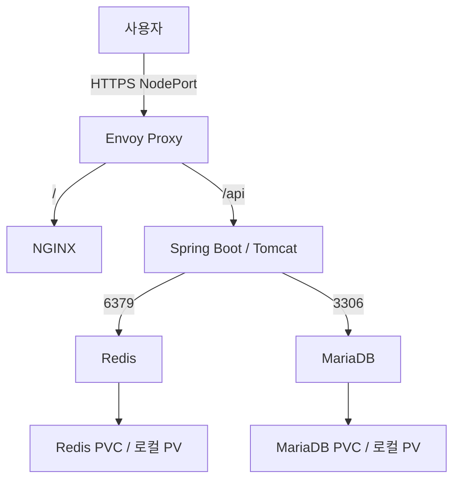

# Rocky Linux 단일 노드 Web/WAS/DB 구축

이 패키지는 kubeadm + containerd + Calico 구성이 끝난 서버에 설치합니다.
기존 업무 애플리케이션을 변경하는 패키지가 아니라, 별도 three-tier Namespace에 만드는 실습 환경입니다.
Spring Boot 예제는 MariaDB에서 메시지를 읽고 Redis에 60초간 캐시합니다.
Redis는 캐시 용도입니다. 로그인·사용자 인증·세션 관리 기능은 이 예제에 없습니다.

## 구성



Gateway API는 라우팅 설정 형식, Envoy Gateway는 이를 관리하는 컨트롤러,
Envoy Proxy는 실제 요청을 처리하는 Pod입니다. API 요청은 NGINX를 거치지 않습니다.
WEB, WAS, Redis, MariaDB는 각각 독립 Pod이며 모든 서버 역할은 같은 물리/가상 서버에서 실행됩니다.

| 항목 | 설정 |
|---|---|
| Namespace | three-tier |
| Envoy Gateway | v1.9.1, 공식 release install.yaml |
| NGINX | stable-alpine 이미지, 정적 실습 페이지 |
| WAS | Spring Boot 3.5.16 + Java 21, Boot가 관리하는 내장 Tomcat |
| MariaDB | 11.8 계열, appdb/appuser |
| Redis | 8 계열, 비밀번호 + AOF, 캐시 상한 256MB |
| 외부 노출 | Envoy HTTPS NodePort 하나 |
| 내부 서비스 | web-svc:80, was-svc:8080, mariadb-svc:3306, redis-svc:6379 |
| 데이터 | /srv/k8s-three-tier/mariadb, /srv/k8s-three-tier/redis |

버전 태그는 일부가 계열 태그라 패치 업데이트에 따라 이미지가 바뀔 수 있습니다.
재현 가능한 운영 배포에서는 검증한 패치 태그 또는 digest로 고정하세요.
서버는 실습 시작점으로 4 vCPU/8GB RAM 이상, 여유 디스크 40GB 이상을 제안합니다.
이는 공식 최소 사양이 아니며 빌드와 데이터량에 따라 더 필요합니다. Java 이미지 빌드 중 자원 사용이 증가합니다.

## 0. 준비 확인

모든 명령은 Kubernetes 서버에 SSH로 접속한 사용자로 실행합니다.
kubectl 권한이 있는 사용자여야 하며, 전체 스크립트에 sudo를 붙이지 않습니다.
호스트 경로 생성과 이미지 빌드/import에 필요한 sudo는 스크립트에 포함했습니다.

```bash
kubectl get nodes -o wide
kubectl get pods -A
kubectl get tigerastatus
kubectl get nodes -L kubernetes.io/hostname
free -h
df -h
```

노드는 Ready, Calico/CoreDNS는 정상이어야 합니다. 아직 CNI 오류가 있으면 먼저 해결합니다.
단일 노드에서 control-plane NoSchedule taint가 남아 있다면 실제 노드명을 지정해서 제거합니다.

```bash
kubectl describe node k8s-single01
kubectl taint nodes k8s-single01 node-role.kubernetes.io/control-plane-
```

이미 taint가 없으면 제거 명령은 생략합니다. node.kubernetes.io/not-ready 등의 taint는 억지로 제거하지 않습니다.
기존 Envoy Gateway/Gateway API 관리자가 있다면 05단계로 같은 CRD를 덮어쓰지 말고 기존 관리자와 호환성을 확인해야 합니다.

```bash
kubectl get deployments -A
kubectl get crd gateways.gateway.networking.k8s.io
```

두 번째 명령의 NotFound는 아직 Gateway API가 없는 새 클러스터에서 정상입니다.

## 1. 압축 해제 및 도구 설치

다운로드한 ZIP을 서버의 로그인 사용자 홈 디렉터리로 업로드합니다.

```bash
sudo dnf install -y unzip curl openssl gettext podman
unzip k8s-three-tier.zip
cd k8s-three-tier
vi config.env
```

config.env에서 다음 값을 실제 환경에 맞춥니다.

```bash
NODE_NAME=k8s-single01
NODE_IP=10.0.0.10
DATA_DIR=/srv/k8s-three-tier
WAS_IMAGE=localhost/three-tier-was:1.0.0
ENVOY_VERSION=v1.9.1
```

NODE_NAME은 kubectl get nodes에 표시되는 이름을 사용합니다. 해당 노드의 kubernetes.io/hostname 라벨도 같은 값인지 확인합니다.
NODE_IP는 VPN으로 접근할 서버 사설 IPv4 주소입니다. 자체 서명 인증서의 IP SAN에도 사용됩니다.
DATA_DIR는 절대경로인 새 전용 디렉터리를 사용하고 공백·따옴표·달러 기호를 넣지 않습니다.
한 번 데이터가 생성된 뒤 DATA_DIR/PV 경로를 바꾸는 작업은 데이터 이전 작업입니다.

Podman은 WAS 이미지 빌드 도구로만 사용합니다. Kubernetes 런타임은 계속 containerd입니다.
스크립트의 podman build --network=host는 빌드 단계 네트워크만 사용하며, WAS Pod는 Calico 네트워크를 사용합니다.
Docker Engine 또는 별도 registry는 이 단일 노드 실습에서 필요하지 않습니다.

노드는 GitHub 릴리스, Docker Hub 및 이미지 저장소/CDN에 접속 가능해야 합니다.
WAS 빌드에는 Maven Central HTTPS 접속도 필요합니다. DNS와 NTP도 정상이어야 합니다.

## 2. Namespace, Secret, 저장소 생성

```bash
bash scripts/01-prepare.sh
kubectl get pv
kubectl -n three-tier get secrets
```

원본 manifests/01-storage.yaml에는 ${NODE_NAME}, ${DATA_DIR}가 있습니다.
스크립트가 config.env 값을 넣어 rendered/01-storage.yaml을 생성하고 적용합니다.
원본 템플릿을 직접 kubectl apply 하지 마세요.

StorageClass three-tier-local은 동적 볼륨 생성기가 아닙니다.
두 개의 local PV를 명시적으로 만들고 DB StatefulSet이 PVC로 연결합니다.
WaitForFirstConsumer 설정이라 Pod가 만들어지기 전까지 볼륨이 바인딩되지 않을 수 있습니다.
PVC에 적힌 20Gi/2Gi는 일반 로컬 디렉터리의 실제 사용량을 강제 제한하지 않습니다. df와 용량 모니터링이 필요합니다.
Retain은 PVC를 삭제해도 PV 데이터를 자동 폐기하지 않도록 하는 설정이며, 백업 또는 서버 이중화 기능은 아닙니다.

NCP Block Storage를 이미 별도 디스크로 연결하고 /srv/k8s-three-tier에 영구 마운트했다면 이 경로를 사용할 수 있습니다.
이 스크립트는 NCP 볼륨 생성, 포맷, 마운트 또는 CSI 설치를 수행하지 않습니다.
별도 디스크가 없으면 현재 파일시스템에 저장합니다. 마운트는 최초 데이터 생성 전에 완료하세요.

비밀번호는 openssl로 각기 생성하고 Kubernetes Secret으로 저장합니다.
기존 Secret은 재생성하지 않습니다. Secret이 유실된 상태에서 이미 초기화된 DB에 새 비밀번호를 넣어도 기존 DB 계정이 바뀌지 않습니다.
Secret은 기본적으로 암호화 저장을 보장하지 않으므로 운영에서는 RBAC와 etcd 암호화도 별도 설정합니다.

## 3. MariaDB와 Redis 실행

```bash
bash scripts/02-data.sh
kubectl -n three-tier get pods,pvc,svc
```

정상 결과는 mariadb-0/redis-0 Ready, PVC Bound입니다.
MariaDB 초기 데이터가 비어 있을 때만 init SQL과 계정 생성 환경변수가 적용됩니다.
ConfigMap을 바꾸거나 Secret을 수정한다고 기존 DB 스키마/계정이 자동 변경되지 않습니다.

MariaDB는 데이터 보관을 위해 PVC를 사용합니다. Redis도 AOF를 PVC에 저장하지만,
여기서는 언제든 DB에서 재생성 가능한 캐시이므로 allkeys-lru 정책을 사용합니다.
세션 저장소로 바꿀 경우 캐시와 세션의 eviction/보존 요구사항을 별도로 설계하세요.

접속 확인:

```bash
kubectl -n three-tier exec mariadb-0 -- sh -ec 'MYSQL_PWD="$MARIADB_PASSWORD" mariadb -uappuser appdb -e "SELECT * FROM demo_message;"'
kubectl -n three-tier exec redis-0 -- sh -ec 'REDISCLI_AUTH="$REDIS_PASSWORD" redis-cli ping'
```

## 4. Spring Boot WAS 빌드 및 배포

```bash
bash scripts/03-was.sh
kubectl -n three-tier logs deployment/was --tail=100
```

스크립트는 Podman의 다단계 빌드로 Maven 패키징 후 JRE 이미지에 app.jar만 넣습니다.
이미지를 tar로 내보내고 containerd의 k8s.io namespace로 import합니다.
Podman에 이미지만 있어서는 kubelet이 그 이미지를 사용할 수 없습니다.
imagePullPolicy: Never이므로 import된 동일한 이름의 로컬 이미지를 사용합니다.
워커를 추가할 때는 registry에 이미지를 push하고 해당 노드가 pull하도록 전환해야 합니다.

```bash
sudo ctr -n k8s.io images list
kubectl -n three-tier get deployment was -o jsonpath='{.spec.template.spec.containers[0].image}'
```

/api/hello는 처음 호출할 때 MariaDB를 읽고 Redis에 60초간 보관합니다.
60초 이내 재호출하면 source=redis가 반환됩니다.
Redis 장애는 DB로 우회하고 MariaDB 장애는 readiness에 반영합니다.
외부 DB 장애를 liveness 조건에 넣어 재시작을 반복시키지 않도록 liveness는 애플리케이션 상태만 확인합니다.

소스를 수정한 후에는 config.env의 WAS_IMAGE 태그를 1.0.1처럼 올리고 03 스크립트를 다시 실행합니다.
같은 태그로 다시 빌드하면 기존 Pod가 자동 교체되지 않습니다.

## 5. WEB 배포

```bash
bash scripts/04-web.sh
kubectl -n three-tier get deployment web
```

NGINX는 ConfigMap의 간단한 HTML 페이지를 제공합니다. API 버튼은 같은 origin의 /api/hello를 호출합니다.
WEB이 WAS로 프록시하는 설정은 없습니다. Gateway가 /와 /api를 분기합니다.
실제 서비스를 배포할 때는 프런트엔드 빌드 산출물을 NGINX 이미지에 포함합니다.

## 6. HTTPS Gateway 구성

```bash
bash scripts/05-gateway.sh
kubectl -n three-tier describe gateway app-gateway
kubectl -n three-tier describe httproute app-routes
kubectl -n envoy-gateway-system get pods,svc
```

공식 Envoy 설치 YAML은 Gateway API와 Envoy CRD 및 컨트롤러를 설치합니다.
이미 다른 제품에서 CRD를 관리 중이면 이 설치 파일을 적용하지 않습니다.
API 리소스 충돌 시 --force-conflicts를 붙이지 말고 관리 주체를 확인합니다.

EnvoyProxy에서 Service 유형을 NodePort로 지정합니다.
직접 구성한 kubeadm 클러스터에서는 LoadBalancer 선언만으로 NCP LB가 자동 생성되지 않습니다.
별도의 LB 연동 없이도 사설 IP:NodePort로 시험할 수 있습니다.

NodePort 확인:

```bash
ENVOY_SERVICE=$(kubectl -n envoy-gateway-system get svc -l gateway.envoyproxy.io/owning-gateway-namespace=three-tier,gateway.envoyproxy.io/owning-gateway-name=app-gateway -o jsonpath='{.items[0].metadata.name}')
kubectl -n envoy-gateway-system get svc "$ENVOY_SERVICE"
```

443:32xxx/TCP처럼 나오는 32xxx가 서버에서 접속하는 포트입니다.
생성된 Service를 삭제/재생성하면 NodePort가 바뀔 수 있으므로 ACG도 확인해야 합니다.
GatewayClass/Gateway Accepted와 HTTPRoute Accepted/ResolvedRefs를 확인합니다.
환경에 따라 NodePort Gateway의 외부 Address 표시가 제한적일 수 있으므로 실제 Service와 요청 결과도 확인합니다.

NCP ACG는 해당 NodePort 하나를 VPN 또는 관리자 출발지에서만 허용합니다.
22/6443도 기존 관리자 제한을 유지하고 DB 3306, Redis 6379, WAS 8080은 외부에 열지 않습니다.
호스트 firewall 또는 NACL을 별도로 운영한다면 실제 왕복 통신도 허용해야 합니다.

인증서는 NODE_IP와 app.test를 SAN으로 넣은 90일 실습용 자체 서명 인증서입니다.
curl --cacert certs/tls.crt로 검증하며 브라우저는 기본 신뢰하지 않아 경고합니다.
보안 설정을 전역으로 끄지 말고 공개 서비스 전환 시 정상 도메인의 신뢰 가능한 인증서로 교체합니다.
공개 서비스에서는 인증 없는 현재 데모 API 대신 실제 인증/권한 검증을 구현해야 합니다.

정식 인증서 교체 예:

```bash
kubectl -n three-tier create secret tls app-tls \
  --cert=/path/to/fullchain.pem --key=/path/to/privkey.pem \
  --dry-run=client -o yaml | kubectl apply -f -
```

정식 도메인으로 DNS를 설정하고 필요하면 HTTPRoute hostnames에 도메인을 제한합니다.
정식 인증서로 교체한 후 07 스크립트의 예전 자체 서명 CA 대신 시스템 CA와 실제 도메인으로 테스트합니다.
80/HTTP 리스너는 이 실습에서 만들지 않습니다. 자동 HTTP→HTTPS 리다이렉트도 아직 없습니다.
실제 외부 443을 원하면 NCP TCP LB의 443을 해당 HTTPS NodePort로 전달하도록 별도 구성할 수 있습니다.
LB 자원과 헬스체크, ACG는 클라우드 측에서 별도 생성/검증하며 이 패키지에서 생성하지 않습니다.

## 7. NetworkPolicy 적용 및 확인

먼저 07 스크립트로 연결을 확인한 뒤 NetworkPolicy를 적용하고 동일 요청을 다시 확인합니다.

```bash
bash scripts/07-check.sh
bash scripts/06-policy.sh
bash scripts/07-check.sh
```

정책은 three-tier namespace만 기본 Ingress/Egress 차단합니다.
envoy-gateway-system과 kube-system에는 default-deny를 적용하지 않습니다.
허용 경로는 Envoy Proxy→WEB/WAS, WAS→MariaDB/Redis, 앱 Pod→CoreDNS입니다.
NGINX→DB/Redis, NGINX→WAS는 허용하지 않습니다.
DNS 예시는 kube-system의 k8s-app=kube-dns Pod를 전제로 합니다.
NodeLocal DNS를 별도로 설치한 환경이면 해당 DNS 경로에 맞춰 정책을 수정해야 합니다.
표준 NetworkPolicy는 노드 자체 트래픽 등의 예외가 있으며 호스트 접근통제를 대체하지 않습니다.

차단 검증(정책 적용 후):

```bash
kubectl -n three-tier exec deployment/web -- sh -c 'nc -z -w 3 mariadb-svc 3306'
kubectl -n three-tier exec deployment/web -- sh -c 'nc -z -w 3 redis-svc 6379'
```

두 명령은 종료코드가 0이 아니어야 합니다. 도구 미설치 오류는 차단 성공으로 간주하지 마세요.
WEB 이미지에 nc가 있는지 먼저 확인하거나 진단용 이미지로 같은 정책 선택 조건에서 검사합니다.
허용 검증은 정책 적용 전/후 모두 /api/hello가 응답하는지 확인합니다.

## 8. 백업

```bash
bash scripts/08-backup.sh
```

backups/appdb-UTC시각.sql.gz와 SHA-256 파일이 생성됩니다.
이 백업은 appdb 스키마/데이터/루틴/이벤트/트리거용이며 시스템 사용자와 Secret 및 etcd 백업은 별도입니다.
덤프 중 스키마 변경을 하지 않습니다. 비트랜잭션 테이블은 --single-transaction만으로 일관성이 보장되지 않습니다.
성공한 파일은 서버 밖 Object Storage 등으로 복사하고 다운로드·복원도 시험해야 합니다.
Object Storage 계정/버킷이 제공되지 않았으므로 자동 업로드는 포함하지 않았습니다.
PVC와 DB 데이터 디렉터리를 단순 압축하는 것보다 DB 일관성이 있는 백업 도구를 사용합니다.
DB root 자격 증명과 appuser, redis Secret을 권한 통제된 별도 저장소에 보관합니다.
복원 실습은 별도 MariaDB 인스턴스/볼륨에 수행하고 검증 후 전환합니다. 운영 DB에 덤프를 바로 덮어쓰지 않습니다.

## 9. 장애 확인

```bash
kubectl -n three-tier get events --sort-by=.lastTimestamp
kubectl -n three-tier describe pod mariadb-0
kubectl -n three-tier describe pvc data-mariadb-0
kubectl -n three-tier logs mariadb-0 --tail=100
kubectl -n three-tier logs redis-0 --tail=100
kubectl -n three-tier logs deployment/was --tail=100
kubectl -n envoy-gateway-system logs deployment/envoy-gateway --tail=100
kubectl -n three-tier get endpointslices
```

| 증상 | 점검 |
|---|---|
| Pending | taint, 자원 부족, PVC, node affinity |
| PVC Pending | 로컬 PV 경로, selector, hostname 라벨 |
| ErrImageNeverPull | containerd k8s.io namespace import 여부와 정확한 이미지명 |
| ImagePullBackOff | 노드 DNS/egress, 저장소 접근, 이미지 태그 |
| WAS CrashLoopBackOff | MariaDB 준비, Secret 일치, 메모리, 이전 로그 --previous |
| API 404 | /api 경로 보존 여부, HTTPRoute Accepted/ResolvedRefs |
| API 503 | WAS readiness, endpoint, NetworkPolicy |
| TLS 오류 | 인증서 SAN에 실제 접속 IP/도메인 포함 여부, CA 신뢰 |
| DB Access denied | 기존 PV 초기 계정과 Secret 불일치 |

문제 분석 중 NetworkPolicy를 일시 해제하려면 다음을 사용하고 원인 확인 후 다시 적용합니다.

```bash
kubectl delete -f manifests/07-network-policy.yaml
```

DB 문제 해결 목적으로 namespace/PVC 또는 /srv 디렉터리를 임의 삭제하지 않습니다.
단일 노드에서 Pod 수를 늘려도 서버 장애에 대한 고가용성은 생기지 않습니다.

## 검증 범위

배포 파일의 YAML 구문, 리소스 연결, 셸 구문을 정적으로 검사했습니다.
작성 환경에는 실제 사용자 Kubernetes 클러스터와 Maven/컨테이너 빌드 실행 환경이 없어
컨테이너 빌드·클러스터 배포·실제 통신 테스트는 수행하지 않았습니다.
스크립트는 서버에서 단계별 rollout 대기와 HTTP/DB/캐시 검증을 수행하도록 구성했습니다.

## 공식 문서

- https://gateway.envoyproxy.io/docs/install/install-yaml/
- https://gateway.envoyproxy.io/docs/tasks/operations/customize-envoyproxy/
- https://gateway.envoyproxy.io/docs/api/extension_types/
- https://kubernetes.io/docs/concepts/storage/volumes/#local
- https://kubernetes.io/docs/concepts/services-networking/network-policies/
- https://docs.spring.io/spring-boot/reference/actuator/endpoints.html
- https://hub.docker.com/_/mariadb
- https://redis.io/docs/latest/operate/oss_and_stack/management/persistence/
